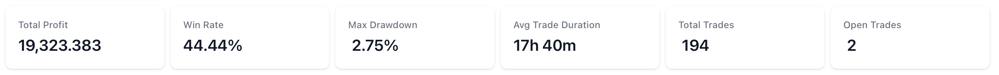

# Managing Your Bot

This guide will help you manage your trading bots in Coincruze, including starting and stopping bots, switching between live and paper trading modes, and understanding the performance metrics and statistics available on the Bot Details page.

## Actions to Start/Stop the Bot

### Starting the Bot

1. Navigate to the Bot Details page.
2. Click the "Start" button.
3. Ensure the bot's status changes to "running".

### Stopping the Bot

1. Navigate to the Bot Details page.
2. Click the "Stop" button.
3. Ensure the bot's status changes to "stopped".

## Switching Between Live and Paper Trading Modes

### Switching to Paper Trading Mode

1. Navigate to the Bot Details page.
2. Click the "Switch to Paper Trading" button.
3. Confirm the transition to paper trading mode.

### Switching to Live Trading Mode

1. Navigate to the Bot Details page.
2. Click the "Go Live" button.
3. Confirm the transition to live trading mode.
4. Ensure your exchange API keys are properly configured and you have sufficient funds in your exchange account.

## Performance Metrics and Statistics

The Bot Details page provides a comprehensive dashboard to monitor your bot's performance. Here are the key metrics and statistics available:

### Performance Metrics

Understanding the performance metrics of your trading bot is crucial for evaluating its effectiveness and making informed decisions. These metrics provide insights into the bot's profitability, risk management, and overall trading behavior. By closely monitoring these statistics, you can identify strengths and weaknesses in your trading strategy, optimize performance, and ultimately achieve better trading outcomes.

#### Total Profit

The Total Profit metric tracks the cumulative profit or loss generated by the trading bot over a specified period. It is a crucial indicator of the bot's overall performance and effectiveness in executing trades. By analyzing the Total Profit, users can assess whether the bot is consistently generating positive returns or incurring losses. This metric helps in making informed decisions about continuing, adjusting, or halting the bot's trading strategy to optimize financial outcomes.

#### Win Rate

The Win Rate metric monitors the success rate of the trading bot's executed trades. It is calculated as the percentage of profitable trades out of the total number of trades made by the bot. A higher Win Rate indicates that the bot is making more successful trades, which can be a sign of an effective trading strategy. However, it is important to consider this metric in conjunction with other performance indicators, as a high Win Rate alone does not guarantee overall profitability, especially if the losses from unsuccessful trades are significant.

#### Max Drawdown

The Max Drawdown metric measures the maximum observed loss from a peak to a trough of the bot's equity curve, before a new peak is achieved. It is a critical indicator of the risk associated with the trading strategy, as it highlights the largest potential loss an investor could face during a trading period. By monitoring Max Drawdown, users can assess the bot's risk management effectiveness and determine if the potential losses are within acceptable limits. This metric helps in making informed decisions about adjusting the bot's strategy to minimize risk and protect capital.

#### Average Trade Duration

The Average Trade Duration metric provides insights into the average length of time the bot holds each trade, helping users understand the bot's trading style, whether it is more short-term or long-term oriented.

#### Total Trades

The Total Trades metric tracks the number of trades the bot has completed, offering a sense of the bot's activity level and trading frequency.

#### Open Trades

he Open Trades metric monitors the number of active positions the bot currently holds in real-time, allowing users to keep track of ongoing trades and manage their exposure to the market.

### Advanced Statistics

Advanced statistics provide deeper insights into your bot's performance, allowing for a more granular analysis of its trading behavior and effectiveness. These statistics help you understand the nuances of your bot's strategy, identify areas for improvement, and make data-driven decisions to enhance overall performance.

#### Duration

The Duration metric tracks the total time the bot has been actively running since its inception. This metric helps users understand the operational lifespan of the bot and evaluate its performance over different time periods. By analyzing the Duration, users can correlate the bot's performance with market conditions and determine the optimal running time for maximizing returns.

#### Profit %

The Profit % metric measures the percentage return on investment generated by the trading bot over a specified period. It is calculated by dividing the net profit by the initial investment and multiplying by 100 to express it as a percentage. This metric provides a clear indication of the bot's profitability and helps users assess the effectiveness of their trading strategy. A higher Profit % signifies better performance, making it a crucial metric for evaluating the success of the bot's trading activities.

#### Profit Factor

The Profit Factor metric evaluates the ratio of the bot's gross profits to its gross losses. It is calculated by dividing the total profit generated from winning trades by the total loss incurred from losing trades. A Profit Factor greater than 1 indicates that the bot is generating more profit than loss, while a value less than 1 suggests that the bot is incurring more losses than profits. This metric is essential for assessing the overall profitability and efficiency of the trading bot's strategy, helping users determine the bot's ability to generate consistent returns over time.

#### Long/Short Trade Distribution

The Long/Short Trade Distribution metric provides an analysis of the proportion of long (buy) and short (sell) trades executed by the trading bot. This metric helps users understand the bot's trading bias and strategy, whether it tends to favor long positions, short positions, or maintains a balanced approach. By examining the distribution, users can gain insights into the bot's market perspective and adjust their strategies accordingly to align with their trading goals and market conditions.

Some trading strategies are designed to execute only buy trades, focusing on accumulating assets rather than selling them. It is perfectly normal to see only buy trades in such strategies, as they aim to capitalize on market opportunities by purchasing assets at favorable prices and holding them for potential future gains.

#### CAGR %

The Compound Annual Growth Rate (CAGR) metric measures the mean annual growth rate of an investment over a specified period of time longer than one year. It represents one of the most accurate ways to calculate and determine returns for anything that can rise or fall in value over time. By considering the effects of compounding, CAGR provides a smoothed annual rate of growth, offering a clear picture of the bot's performance and helping users compare it with other investments or benchmarks.

To illustrate the Compound Annual Growth Rate (CAGR), let's consider an example:

Suppose you invested $10,000 in a trading bot at the beginning of 2020, and by the end of 2023, your investment has grown to $15,000. The CAGR can be calculated using the following formula:

\[ \text{CAGR} = \left( \frac{\text{Ending Value}}{\text{Beginning Value}} \right)^{\frac{1}{n}} - 1 \]

Where:

- Ending Value = $15,000
- Beginning Value = $10,000
- \( n \) = number of years (3 years in this case)

Plugging in the values:

\[ \text{CAGR} = \left( \frac{15,000}{10,000} \right)^{\frac{1}{3}} - 1 \]

\[ \text{CAGR} = \left( 1.5 \right)^{\frac{1}{3}} - 1 \]

\[ \text{CAGR} \approx 0.1447 \text{ or } 14.47\% \]

This means that the trading bot achieved an average annual growth rate of approximately 14.47% over the 3-year period. The CAGR provides a smoothed annual rate of growth, allowing you to compare the bot's performance with other investments or benchmarks.

By understanding the CAGR, you can better evaluate the long-term performance of your trading bot and make more informed investment decisions.

#### Sharpe Ratio

The Sharpe Ratio is a measure used to evaluate the risk-adjusted return of an investment or trading strategy. It is calculated by subtracting the risk-free rate from the bot's return and then dividing the result by the standard deviation of the bot's returns. A higher Sharpe Ratio indicates that the bot is generating better returns for each unit of risk taken, making it a valuable metric for assessing the efficiency and performance of the trading bot in relation to its risk exposure.

To better understand the Sharpe Ratio, let's consider an example:

Suppose your trading bot has an annual return of 15%, and the risk-free rate (such as the return on a 10-year government bond) is 2%. The standard deviation of the bot's returns, which measures the volatility or risk, is 10%.

The Sharpe Ratio is calculated as follows:

\[ \text{Sharpe Ratio} = \frac{\text{Annual Return} - \text{Risk-Free Rate}}{\text{Standard Deviation}} \]

Plugging in the values:

\[ \text{Sharpe Ratio} = \frac{15\% - 2\%}{10\%} = \frac{13\%}{10\%} = 1.3 \]

A Sharpe Ratio of 1.3 indicates that the bot is generating 1.3 units of return for each unit of risk taken. Generally, a Sharpe Ratio above 1 is considered good, above 2 is very good, and above 3 is excellent. This metric helps you assess whether the returns of your bot are worth the risks taken.

#### Calmar Ratio

The Calmar Ratio is a metric used to evaluate the risk-adjusted performance of a trading strategy by comparing the average annual compounded return to the maximum drawdown. It helps investors understand how well the trading bot performs relative to the risk it takes, with a higher Calmar Ratio indicating better risk-adjusted returns.

To calculate the Calmar Ratio, use the following formula:

\[ \text{Calmar Ratio} = \frac{\text{CAGR}}{\text{Max Drawdown}} \]

Where:

- CAGR is the Compound Annual Growth Rate.
- Max Drawdown is the maximum observed loss from a peak to a trough.

Let's consider an example to illustrate the Calmar Ratio:

Suppose your trading bot has a CAGR of 14.47% (as calculated in the previous example) and a Max Drawdown of 20%.

The Calmar Ratio is calculated as follows:

\[ \text{Calmar Ratio} = \frac{14.47\%}{20\%} = 0.7235 \]

A Calmar Ratio of 0.7235 indicates that for every unit of risk (as measured by the Max Drawdown), the bot generates approximately 0.7235 units of return. Generally, a higher Calmar Ratio is preferred, as it signifies better performance relative to the risk taken.

By understanding the Calmar Ratio, you can better assess the risk-adjusted performance of your trading bot and make more informed decisions about its strategy.

## Open Trades List

The Open Trades table offers a dynamic snapshot of your bot's active positions, empowering you to stay on top of your trading activities.

The Open Trades table includes Trade ID, Symbol (Pair), Stake Amount, Current Price, and Open Date/Time. It provides a quick overview of each active trade, allowing you to monitor key details such as the trade's identifier, the asset being traded, the price at which the trade was entered, its current market price, the amount of the asset being traded, the profit or loss generated so far, and the duration of the trade.

The current profit values are regularly refreshing, providing near real-time information about the performance of each open trade.

!!! tip
    To review individual trade details, click on the trade ID.

## Closed Trades List

The Closed Trades table provides a detailed record of your bot's completed trades, allowing you to analyze past performance and refine your trading strategies. It includes Trade ID, Symbol (Pair), Stake Amount, Profit, Open Date, Close Date, and Close Reason. By reviewing the Closed Trades table, you can gain valuable insights into your bot's historical trading activities and make data-driven decisions to enhance future performance.

!!! tip
    To review individual trade details, click on the trade ID.

By understanding these metrics and statistics, you can make informed decisions about your trading strategies and optimize your bot's performance.
